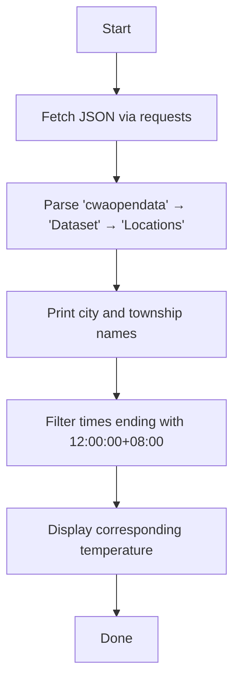

# Taiwan CWB Weather Forecast Fetcher (Taichung 3-Day Forecast)

This script fetches **3-day township-level weather forecasts** for **Taichung City**
from the **Central Weather Administration (CWA) Open Data API**.

## 🧩 Overview

| Function | Description |
|-----------|--------------|
| `fetch_weather_json()` | Fetches raw JSON data from CWA Open Data API. |
| `extract_locations()` | Extracts the `Locations` section from the API result. |
| `print_location_names()` | Lists city and all township names. |
| `print_noon_temperatures()` | Prints temperature readings for **12:00:00+08:00** for the next 3 days. |

## ⚙️ API Information

| Item | Description |
|------|--------------|
| Data Set | F-D0047-073 — Taichung City 3-Day Forecast |
| Source | https://opendata.cwa.gov.tw/dataset/all/F-D0047-073 |
| API URL | `https://opendata.cwa.gov.tw/fileapi/v1/opendataapi/F-D0047-073` |
| Format | JSON |
| Authorization | Required (`Authorization=<your code>`) |

## 🧠 Requirements

| Library | Purpose |
|----------|----------|
| `requests` | For HTTP requests |
| `json` | Parse API response |
| `urllib3` | Disable SSL warnings |

Install dependencies:
```bash
pip install requests urllib3
```

## 🪶 Usage

1️⃣ **Edit the authorization code**
```python
AUTH_CODE = "YOUR_AUTHORIZATION_CODE"
```

2️⃣ **Run the script**
```bash
python weather.py
```

3️⃣ **Example output**
```
縣市名稱: 臺中市
  鄉鎮名稱: 西區
  鄉鎮名稱: 北屯區
  鄉鎮名稱: 太平區
...

=== 區域：西區 ===
2025-01-26T12:00:00+08:00 → 溫度：24°C
2025-01-27T12:00:00+08:00 → 溫度：22°C
2025-01-28T12:00:00+08:00 → 溫度：21°C
```

## ⚙️ Internal Logic



## ⚠️ Notes
- You must **apply for an Authorization Code** from [CWA Open Data Portal](https://opendata.cwa.gov.tw/).
- SSL verification is disabled for convenience; remove `verify=False` for production use.
- For educational/research use only — please comply with CWA’s data terms.

