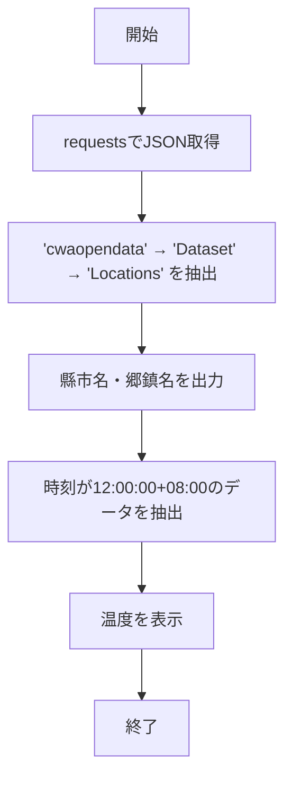

# 台湾中央気象局（CWB）天気予報取得スクリプト（台中市3日間予報）

本スクリプトは、台湾の **中央気象局（CWB）開放データAPI** を利用して
**台中市の3日間の郷鎮（エリア）別天気予報** を取得します。

## 🧩 概要

| 関数 | 説明 |
|------|------|
| `fetch_weather_json()` | 気象局APIからJSONデータを取得 |
| `extract_locations()` | APIレスポンス内の `Locations` セクションを抽出 |
| `print_location_names()` | 市名と全ての郷鎮名を表示 |
| `print_noon_temperatures()` | 各郷鎮の **12:00:00+08:00** 時間帯の温度を出力（3日分） |

## ⚙️ API 情報

| 項目 | 内容 |
|------|------|
| データセット | F-D0047-073 — 台中市3日間予報 |
| ソース | https://opendata.cwa.gov.tw/dataset/all/F-D0047-073 |
| API URL | `https://opendata.cwa.gov.tw/fileapi/v1/opendataapi/F-D0047-073` |
| フォーマット | JSON |
| 認証 | 必須（`Authorization=<あなたの認証コード>`） |

## 🧠 必要ライブラリ

| ライブラリ | 用途 |
|-------------|------|
| `requests` | HTTP 通信 |
| `json` | データ解析 |
| `urllib3` | SSL警告の無効化 |

インストール：
```bash
pip install requests urllib3
```

## 🪶 使い方

1️⃣ **認証コードを設定**
```python
AUTH_CODE = "あなたの認証コード"
```

2️⃣ **スクリプトを実行**
```bash
python weather.py
```

3️⃣ **出力例**
```
縣市名稱: 臺中市
  鄉鎮名稱: 西區
  鄉鎮名稱: 北屯區
  鄉鎮名稱: 太平區
...

=== 區域：西區 ===
2025-01-26T12:00:00+08:00 → 溫度：24°C
2025-01-27T12:00:00+08:00 → 溫度：22°C
2025-01-28T12:00:00+08:00 → 溫度：21°C
```

## ⚙️ 処理の流れ



## ⚠️ 注意事項
- **中央気象局の開放データポータル**で認証コードを取得してください。
- `verify=False` は開発用設定です。本番環境では削除推奨。
- 本スクリプトは **学習・研究目的限定** です。データ利用規約を遵守してください。

